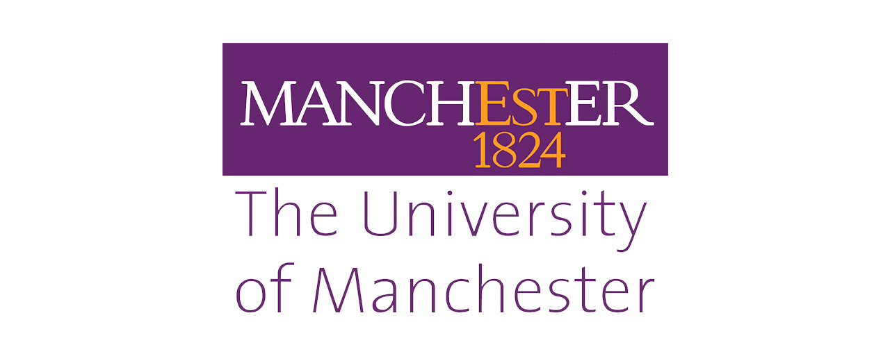

# Hello there! Welcome to my portfolio.
It seems you've stumbled upon my little corner of the web. This is my online portfolio where you can find information about my experience, completed projects, and what I'm currently working on. To find what you need, just use the sidebar navigation.

# About Me 👨‍💻
My name is Syauqi. My journey in engineering spans six years, starting with a Diploma in Industrial Electronics from the **German-Malaysian Institute** 🇲🇾. Afterwards, I continued my studies for another three years at **The University of Manchester** 🇬🇧, where I obtained a Bachelor's degree in Electrical and Electronic Engineering.

  
  

My passion lies firmly in electronics, not so much the high-voltage electrical side.

> Big voltage is scawwy... I prefer to play with smol voltage 😗

At heart, I'm an electronics hobbyist who enjoys working on various projects to enhance my design skills and learn new things.

#### My Core Interests 💡
* Designing low-powered electronics
* Creating small form-factor PCBs
* Machine Learning *(psst... haven't actually started anything on this yet)*
* Computer Vision *(same as above, oops)*

# Current Status 🔬
As of September 2023, I am currently working as an **Electronic Engineer (Research Technician)** at University College London (UCL).

  

> ##### TIP
>
> I'm actively looking for side-gigs and collaborations, namely as a part-time electronics or embedded engineer. Let's build something cool together!
{: .block-tip }