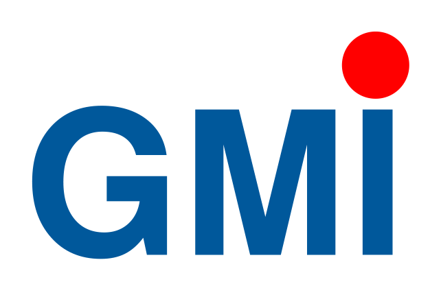

# Welcome to my portfolio
Greetings! This is my online portfolio where you can access information about my experience, previous projects, and upcoming project plans.

To find the information you need, simply use the sidebar navigation.

# About
Hi, my name is Syauqi Alias, but you can call me Syauqi. I studied engineering for 6 years. I spent the first 3 years at the German-Malaysian Institute studying for a Diploma in Industrial Electronic (Electronic & I.T). After that, I continued my studies for another 3 years at The University of Manchester, where I obtained a Bachelor's degree in Engineering in Electrical and Electronics.

An electronic hobbyist at heart and enjoy working on various projects to enhance my design skills and learn new things.

These are the areas I am interested in:
- Machine Learning
- Computer Vision
- Designing low-powered electronics
- Creating small form factor designs

# Current Status
I am an Electronics Engineer currently employed at Top Hex Ltd in Cambridge since October 2021.

> ##### TIP
>
> I am actively seeking new opportunities in Cambridge as an Electronic 
> Engineer or Embedded System Engineer.
{: .block-tip }
