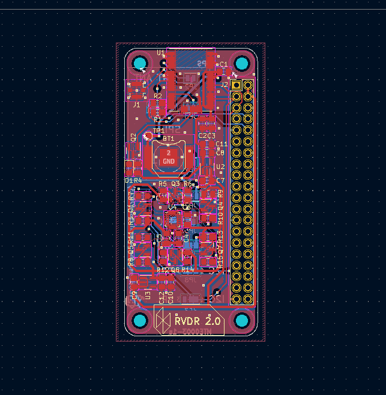

# RVDR V2.0
Road Vehicle Data Recorder (RVDR) second revision. It's a smaller version of the first version. Some key changes were made as follows:

- Replace the GNSS module with built-in GPS/GNSS antenna modules using u-blox CAM-M8 series (external antenna is optional).
- Replace multiple sensor ICs with a single TDK ICM-20948 9-Axis MEMS motion tracking (although this is actually a downgrade from the previous 10-DOF sensor).
- Reduced the size to match that of a Raspberry Pi Zero W
- Added an option at the back of the board to choose the communication protocol: UART, SPI or I2C.

> ##### TIP
>
>There are some things I can do to improve the design like implementing a 
>single Voltage shifter IC (Analog Devices MAX3378EE) rather than having 
>multiple MOSFETs to upscale the signal and free up some space for more 
>sensors. Perhaps this is something I could explore in the third revision.
{: .block-tip }